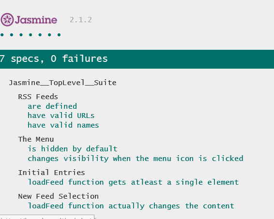

# Project Overview

In this project we are given a web-based application that reads RSS feeds.
The application incoporates Jasmine to write a number of tests that test the underlying business logic of the application as well as the event handling and DOM manipulation.

## How to Run the Application

1. Download the application files to a directory, say, `feedreader-test`.
2. Run a HTTP server and configure it to serve the files in `feedreader-test` directory. One easy way of doing this is to run `python -m SimpleHTTPServer` from `feedreader-test` directory.
3. Launch a browser client and point to the index.html file in the server. The app will launch normally listing some RSS feeds. The test suite will run and report the results. Sample results are as below:
                
4. At times, the asynchronous calls may not complete within the stipulated time interval and one or two tests relying on async calls to fail. In such cases, you may just retry loading the application again. Alternatively, you could also experiment with the default timeout settings as configured in `jasmine.DEFAULT_TIMEOUT_INTERVAL`. This has been already enhanced to 10s instead of default 5s, so ideally there shouldn't be an need to play with this setting.   
